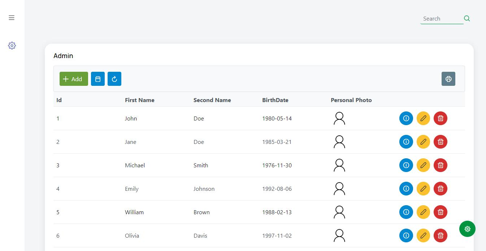
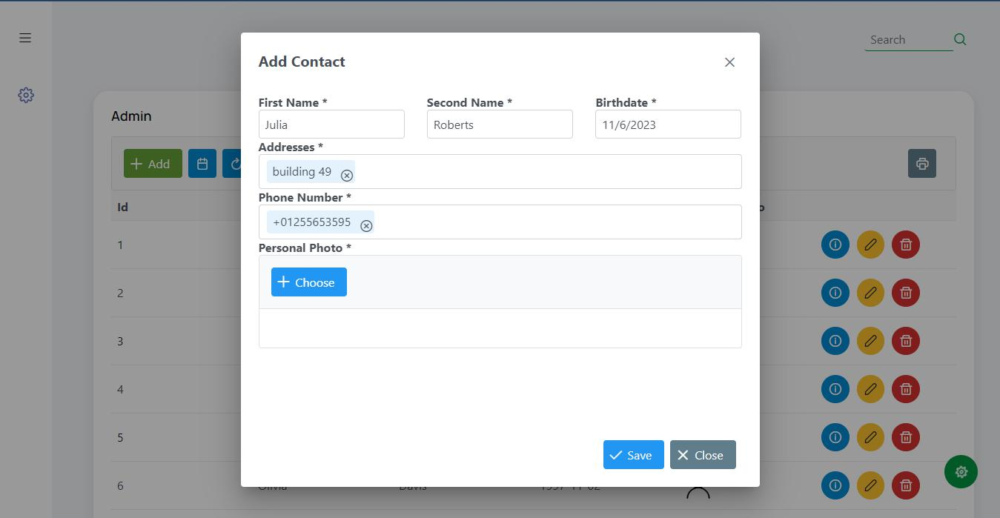
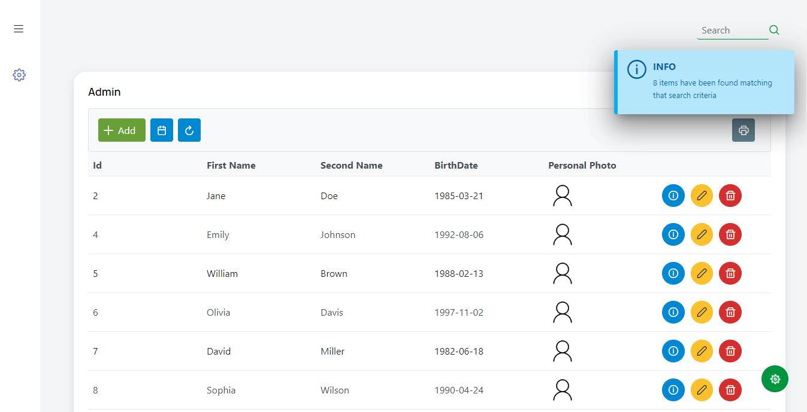

# Contacts - FrontEnd

This project has been developed with the purpose of taking control of Contacts. It has been developed in Java (with Maven) using the environment provided by Jakarta Server Faces (JSF).

This project uses jakarta server faces in its version 10.0. Supported by the interface that Primefaces 12 presents, it presents the user with a simple and friendly interface.
Java 18 and JBoss Wildfly version 26 were used for its development.

To start this service you just need to compile the project using maven (you can use the following command):
```bash
$ mvn clean package
```
In this way you will obtain the file in .war format that you can then use to deploy it on the Jboss Wildfly web server.

## Index Web Page

Once deployed you can access the home page through the link:
- http://localhost:8080/ContactsFrontEnd_war_exploded/index.xhtml : This url will allow you to access the home page where you can add, modify or delete contacts. In the same way, you can search by names and surnames or by date ranges.

### Index Web Page Example.


### Add Contact Modal example.


### Search by Date Example.
